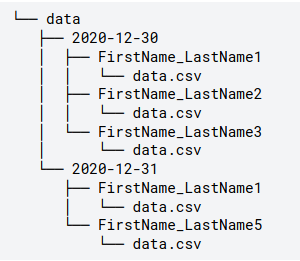

This is the fifth dataset analysed by me while passing [data analysis course](https://karpov.courses/) I've enrolled in January 2021.   

Raw Data Handling -- creating dataframe from a set of csv-files stored in various folders. Practicing Python skills to automate data handling.  

Folders tree is shown below:  

Hope this repo will help you to assess my coding, data analytics and SQL skills or will be just fun for you to look through.    

--------------------------------------------
Fill free to contact me via nktn.lx@gmal.com  
Follow me on twitter: @nktn_lx  
And here on github: github.com/nktnlx  